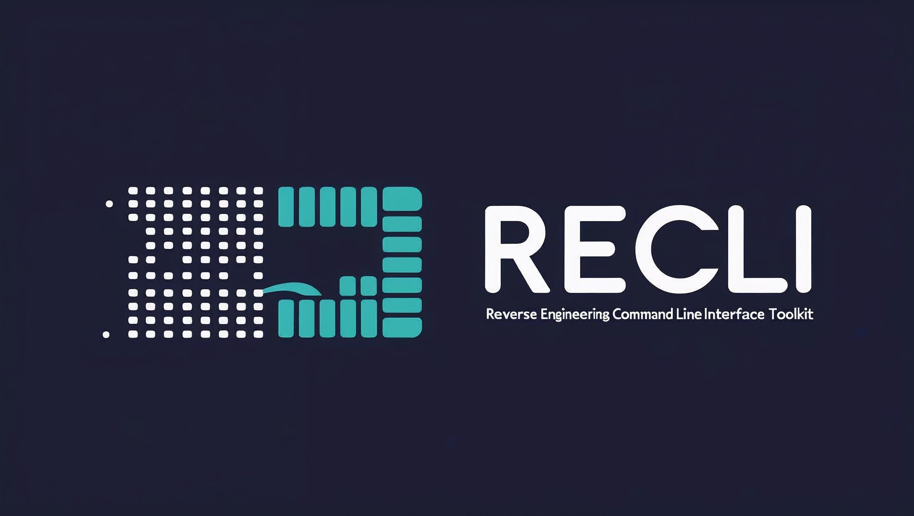

# RECLI - Reverse Engineering Command Line Interface Toolkit

 

**RECLI** is a powerful, modular command-line toolkit designed for professional reverse engineering tasks. It provides a comprehensive set of tools for analyzing binaries, extracting information, and performing advanced static and dynamic analysis.

## Features

- **Multi-format Support**: Analyze PE, ELF, Mach-O binaries
- **Comprehensive Analysis**:
  - String extraction (ASCII, Unicode, obfuscated)
  - API call detection and analysis
  - Offset and reference scanning
  - Control flow graph generation
- **Advanced Capabilities**:
  - Ghidra integration for decompilation
  - YARA rule scanning
  - Binary patching
  - Memory analysis and dumping
- **Professional Output**:
  - Multiple output formats (Text, JSON, Markdown)
  - Customizable reporting
  - Scriptable interface

## Installation

### Prerequisites

- Linux (recommended) or Windows (WSL)
- CMake 3.15+
- C++17 compatible compiler
- Python 3.6+ (for some modules)

### Build Instructions

```bash
# Clone the repository
git clone https://github.com/odaysec/recli.git
cd recli

# Install dependencies
./scripts/setup_dependencies.sh

# Build and install
mkdir build
cd build
cmake ..
make -j$(nproc)
sudo make install
```

### Docker Option

```bash
docker build -t recli .
docker run -it --rm -v $(pwd):/data recli [COMMAND] [OPTIONS]
```

## Usage

### Basic Syntax

```bash
recli [GLOBAL_OPTIONS] <COMMAND> [COMMAND_OPTIONS] <INPUT_FILE>
```

### Global Options

| Option | Description |
|--------|-------------|
| `-v, --verbose` | Enable verbose output |
| `-f, --format` | Output format (text/json/md) |
| `-o, --output` | Output file path |
| `--version` | Show version information |
| `--help` | Show help message |


#### Basic Analysis

```bash
# Extract strings
recli strings [--min-length=4] [--unicode] target.exe

# Show binary headers
recli headers target.so

# List sections
recli sections --perms target.dll
```

#### Advanced Analysis

```bash
# Disassemble code
recli disasm --section=.text target.bin

# Generate control flow graph
recli cfg --function=main --format=dot target.elf

# Scan with YARA rules
recli scan --rules=malware_rules.yara suspicious.exe
```

#### Binary Manipulation

```bash
# Patch binary
recli patch --offset=0x1234 --bytes="90 90 90" target.exe

# Dump memory region
recli dump --address=0x401000 --size=256 process.dmp
```


### Basic Binary Analysis

```bash
# Analyze a Windows executable
recli analyze malware.exe -f json -o report.json

# View results
jq '.' report.json
```

### Advanced RE Workflow

```bash
# 1. Extract interesting strings
recli strings --min-length=8 --unicode malware.bin > strings.txt

# 2. Find API calls
recli api --format=md malware.bin > api_calls.md

# 3. Decompile interesting functions
recli decompile --function=encrypt_data malware.bin -o decryptor.c

# 4. Patch the binary
recli patch --offset=0x4012a0 --bytes="31 C0" malware.bin -o malware_patched.bin
```

## Modules Documentation

RECLI is organized into several specialized modules:

1. **String Analysis**: Extract various string types from binaries
2. **Binary Parser**: Handle file formats and headers
3. **Disassembler**: Capstone-based code analysis
4. **Decompiler**: Ghidra integration for pseudo-code
5. **Memory Analysis**: Runtime memory inspection
6. **Pattern Scanner**: YARA and signature scanning
7. **Patching**: Binary modification tools

For detailed module documentation, see [API Reference](docs/api-reference.md).

